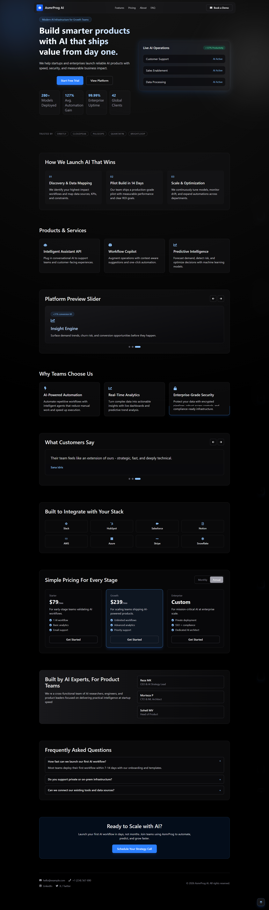

#AI — Landing Page

A modern, responsive landing page for an AI infrastructure company. Built with React and Tailwind CSS, it showcases products, pricing, testimonials, integrations, and more in a polished dark-themed UI.


## Features

- **Hero section** — Headline, CTAs, live stats, and an AI operations preview card
- **Workflow overview** — Three-step process for launching AI products
- **Products & services** — Feature cards with icons and descriptions
- **Platform slider** — Auto-rotating showcase with manual prev/next controls
- **Testimonials** — Carousel with auto-rotation and dot navigation
- **Integrations** — Grid of supported tools (Slack, HubSpot, Salesforce, AWS, and more)
- **Pricing** — Monthly/annual billing toggle with three tiers
- **About & team** — Company intro and team member list
- **FAQ** — Expandable accordion
- **Sticky header** — Scroll-aware navbar with mobile menu
- **Scroll animations** — Reveal-on-scroll effects via Intersection Observer
- **Back to top** — Floating button after scrolling

## Tech Stack

| Technology | Purpose |
|------------|---------|
| [React 19](https://react.dev/) | UI components and state |
| [Vite 8](https://vite.dev/) | Dev server and production build |
| [Tailwind CSS 4](https://tailwindcss.com/) | Utility-first styling |
| [React Icons](https://react-icons.github.io/react-icons/) | Icon set |
| [ESLint](https://eslint.org/) | Code linting |

## Getting Started

### Prerequisites

- [Node.js](https://nodejs.org/) 18 or later
- npm (included with Node.js)

### Installation

```bash
git clone https://github.com/YOUR_USERNAME/ai-company-landing.git
cd ai-company-landing
npm install
```

### Development

```bash
npm run dev
```

Open the URL shown in the terminal (usually `http://localhost:5173`).

### Build for production

```bash
npm run build
```

Output is written to the `dist/` folder.

### Preview production build

```bash
npm run preview
```

### Lint

```bash
npm run lint
```

## Project Structure

```
├── index.html
├── vite.config.js
├── eslint.config.js
└── src/
    ├── main.jsx
    ├── App.jsx
    ├── index.css
    ├── data/
    │   └── landingData.js      # All page content (stats, pricing, FAQs, etc.)
    ├── hooks/
    │   ├── useAutoRotate.js    # Carousel auto-rotation
    │   ├── useRevealOnScroll.js
    │   └── useScrollState.js   # Header + back-to-top scroll state
    └── components/
        ├── common/
        │   └── BackToTopButton.jsx
        ├── layout/
        │   ├── SiteHeader.jsx
        │   └── SiteFooter.jsx
        └── sections/
            └── LandingSections.jsx
```

## Customization

Most copy, pricing, team info, and section data live in a single file:

**`src/data/landingData.js`**

Edit exports such as `stats`, `services`, `pricing`, `testimonials`, `team`, and `faqs` to match your brand without touching component logic.

For branding and layout:

- **Logo & site name** — `src/components/layout/SiteHeader.jsx`
- **Footer contact & social links** — `src/components/layout/SiteFooter.jsx`
- **Page title** — `index.html`
- **Global styles & animations** — `src/index.css`

## Deployment

This is a static Vite app. After `npm run build`, deploy the `dist/` folder to any static host:

- [GitHub Pages](https://pages.github.com/)
- [Vercel](https://vercel.com/)
- [Netlify](https://www.netlify.com/)
- [Cloudflare Pages](https://pages.cloudflare.com/)

For GitHub Pages with a project site (e.g. `username.github.io/repo-name`), set `base` in `vite.config.js`:

```js
export default defineConfig({
  base: '/your-repo-name/',
  plugins: [react(), tailwindcss()],
})
```

---

Built By [Reza MK - AsmrProg](https://youtube.com/@AsmrProg)


## Preview


